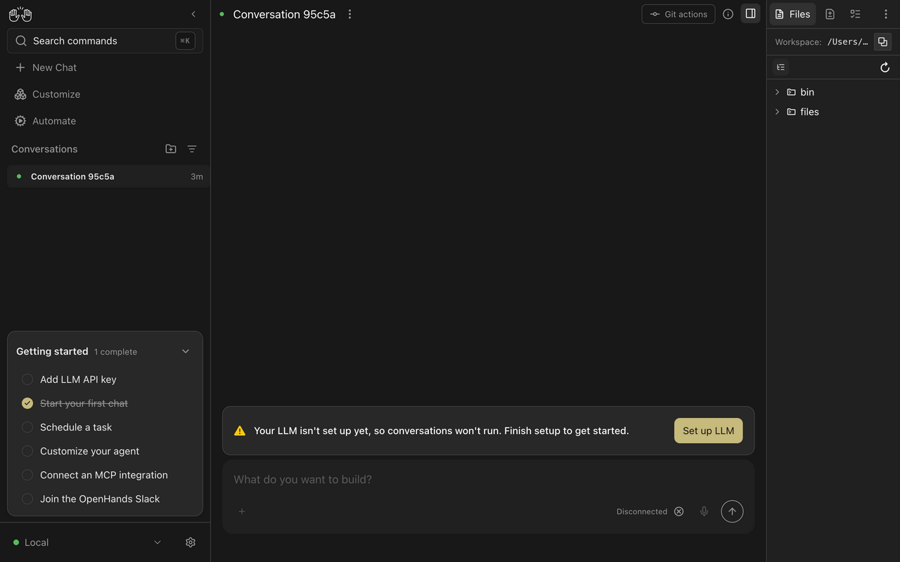
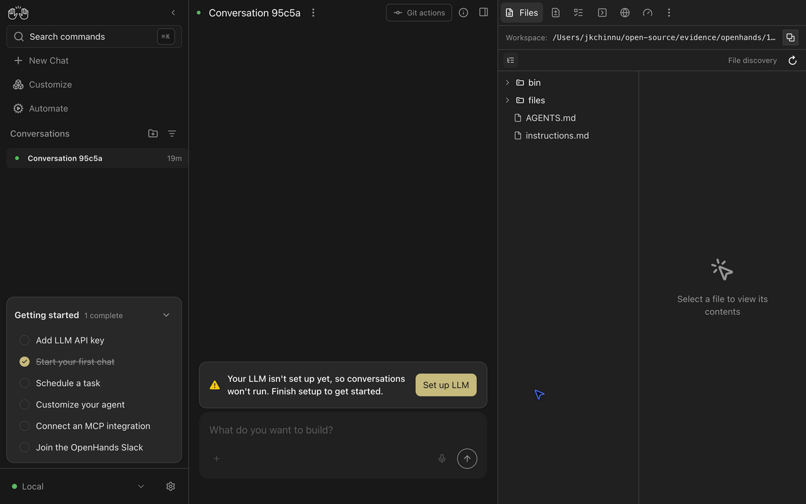

# Configurable workspace file discovery

The local Files panel can now list workspaces larger than 2,000 files and include file symlinks. Settings belong to the current backend and workspace. Existing defaults remain unchanged. Cloud listing keeps its existing API and behavior.

## Before and after

| Area               | Before                                             | After                                                              |
| ------------------ | -------------------------------------------------- | ------------------------------------------------------------------ |
| Discovery          | Fixed directory exclusions and 2,000 regular files | Editable directory exclusions, an optional limit and file symlinks |
| Incomplete results | Silent truncation                                  | Fetch one extra result and show a warning when files are omitted   |
| Persistence        | No discovery settings                              | Workspace-keyed values in existing server app preferences          |
| Controls           | No configuration                                   | Save, cancel and reset in the local Files panel                    |

The [previous local listing hook](https://github.com/OpenHands/OpenHands/blob/a8c8fb377761fc7c562f19db1d9da75bba413cb9/src/hooks/query/use-workspace-files.ts) built a fixed shell command. The [updated hook](https://github.com/kr1shna-exe/OpenHands/blob/745692b2233da9766bb759cb3535fa4f996a4abe/src/hooks/query/use-workspace-files.ts#L45) waits for workspace settings and calls the [command builder](https://github.com/kr1shna-exe/OpenHands/blob/745692b2233da9766bb759cb3535fa4f996a4abe/src/utils/workspace-file-discovery.ts). That builder quotes exclusion patterns as shell data, prunes matching directories and fetches one extra path for finite limits. The parser removes the extra path while retaining the truncation flag.

## State and compatibility

The [settings hook](https://github.com/kr1shna-exe/OpenHands/blob/745692b2233da9766bb759cb3535fa4f996a4abe/src/hooks/query/use-workspace-file-discovery.ts) reads and writes `misc_settings.app_preferences.workspace_file_discovery` through the existing settings service. Each workspace path maps to `excludedPatterns`, `maxFiles` and `includeSymlinks`. A zero limit means unlimited. Sparse patches preserve other workspaces. Missing or malformed values fall back to existing defaults.

The [dialog](https://github.com/kr1shna-exe/OpenHands/blob/745692b2233da9766bb759cb3535fa4f996a4abe/src/components/features/files-tab/workspace-file-discovery-settings.tsx) owns only unsaved input. Saving invalidates the settings query; cancel discards changes. A backend or workspace change resets the dialog scope. The mutation checks the active backend before writing. The [Files route](https://github.com/kr1shna-exe/OpenHands/blob/745692b2233da9766bb759cb3535fa4f996a4abe/src/routes/files-tab.tsx#L151) exposes the control and displays the truncation warning.

This adds frontend-owned preferences to an existing opaque server field. It requires no new endpoint, server minimum-version increase or deployment migration.

## Runtime evidence

A real Agent Server 1.50.1 workspace contained 2,005 numbered files plus root `bin`, nested `bin`, `obj`, an instructions file and an `AGENTS.md` file symlink. The original command returned 2,000 paths. With unlimited discovery, file symlinks and exclusions `.git`, `node_modules`, `*/bin` and `obj`, the updated listing returned 2,008 paths. It retained root `bin`, omitted nested `bin` and `obj` and included the symlink. Reload preserved the configuration. Setting the limit to 3 showed the incomplete-tree warning.

| Before                                       | After                                         |
| -------------------------------------------- | --------------------------------------------- |
|  |  |

[Settings screenshot](04-settings.png), [truncation warning](05-truncated.png) and [runtime recording](03-demo.mp4) show the same real backend flow. The recording includes initial UI setup. No model execution is needed for file discovery.

## Verification and limits

- `LANG=en_US.UTF-8 npm test`: 8,084 passed across 767 files with 7 existing TODOs.
- Five focused suites: 78 passed, including shell-backed command execution and settings persistence.
- `npm run lint`, `npm run build` and `npm run build:lib`: passed.
- `npm run check-translation-completeness`: all 15 locales covered.

Unlimited discovery can be expensive for large workspaces. Directory symlinks are not traversed. The existing line-based listing cannot represent filenames containing line breaks. Cross-window live settings synchronization is unchanged; reloading reads persisted values.

These `.pr/17863/` files are temporary review artifacts and should be removed before merge. Source links use the implementation commit so they remain stable after artifact cleanup.
